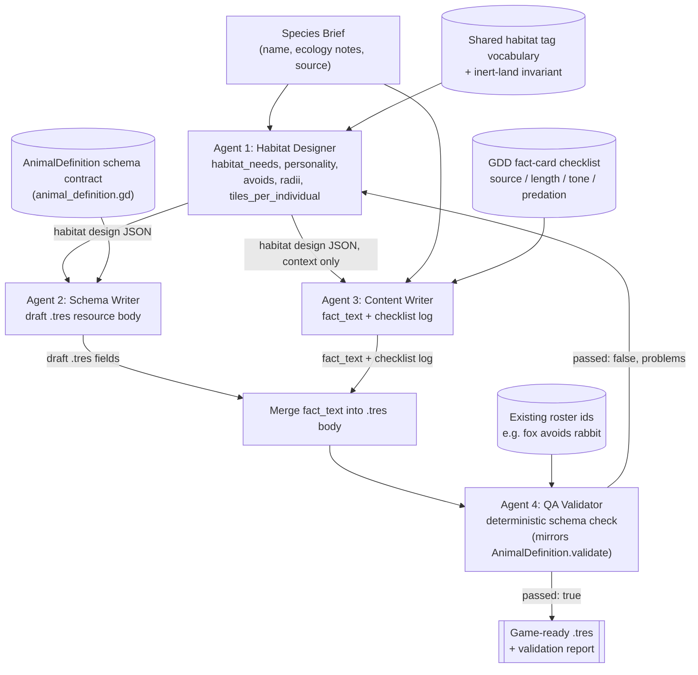

# Wildhaven Species Content Crew — Architecture

**Data flow, in order:**

1. A `SpeciesBrief` (name + 2-4 sourced ecology facts) enters the crew.
2. **Habitat Designer** turns it into habitat/tuning data, checked against the
   inert-land invariant (a species can't be satisfiable by land the player never touched).
3. Its output fans out to two agents that run independently, since neither depends on
   the other's output:
   - **Schema Writer** encodes it as a valid `AnimalDefinition` `.tres` body.
   - **Content Writer** drafts the fact card against the GDD's four-step checklist.
4. The orchestrator merges the fact card into the `.tres` body (string substitution,
   not an agent step — no judgment involved).
5. **QA Validator** deterministically re-checks the merged result against the same
   rules `AnimalDefinition.validate()` enforces in the real game. A failure returns
   a `problems` list; in a longer-running crew this would loop back to the Habitat
   Designer with the QA report attached (shown as the dashed feedback path above; the
   reference implementation runs one pass and reports the failure instead of auto-retrying).
